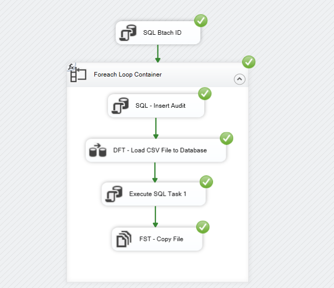
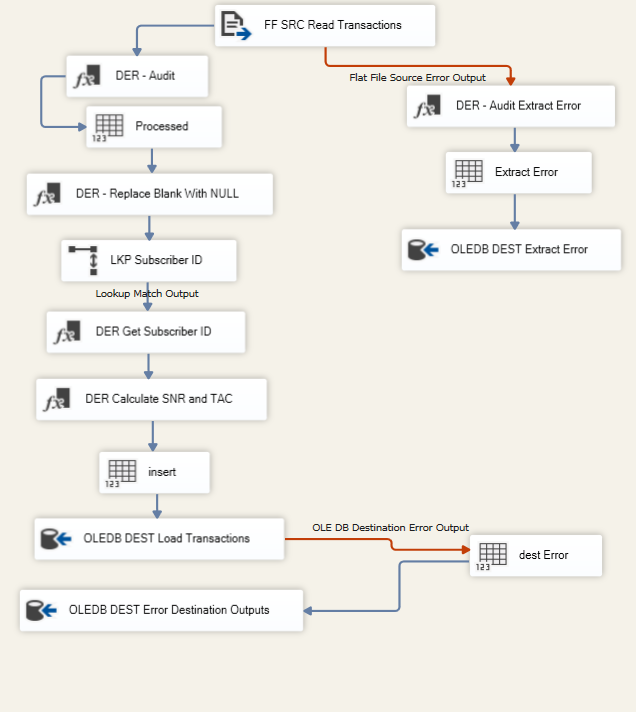

# Telecom-ETL-SSIS

## 📌 Project Overview
This project implements an end-to-end ETL pipeline for a telecom company using SSIS

The pipeline processes transaction data generated every 5 minutes in CSV format, applies data validation and transformation rules, and loads the data into a structured Data Warehouse

## 🎯 Business Problem
The telecom system generates high-frequency transaction data that requires:

- Cleaning and validation
- Transformation into structured format
- Handling of invalid/rejected records
- Historical storage for analytics

This project solves these challenges by building a robust ETL pipeline

## 📂 Data Source
- CSV files generated every 5 minutes
- Each file represents a batch of telecom transactions

## ⚙️ Data Transformation & Validation

### ✅ Validations
- Reject records if IMSI is NULL
- Reject records if CELL or LAC is NULL
- Reject records if EVENT_TS is invalid

### 🔄 Transformations
- Extract TAC (first 8 digits of IMEI)
- Extract SNR (last 6 digits of IMEI)
- Default invalid IMEI values to -99999
- Map IMSI to subscriber_id using reference table
- If not found → assign -99999

## 🏗️ Data Model

The data is loaded into a Data Warehouse with:

- Fact Table: Transactions
- Dimension Tables: Subscriber (via IMSI reference)

## 🔄 ETL Pipeline Design

### 🔁 Control Flow

This represents the orchestration of the ETL process including:
- File handling
- Data loading
- Error handling

### 🔀 Data Flow

This shows the detailed data transformation pipeline including:
- Data validation
- Column transformations
- Lookup operations
- Splitting valid and rejected records

## ❌ Rejected Records Handling

Invalid records are stored in a separate table along with:

- Original file name
- Reason for rejection

## 📦 File Handling

After successful processing:
- Files are moved to an Archive/Processed folder

## 🛠️ Tech Stack
- SQL Server
- SSIS (SQL Server Integration Services)
- CSV Files

## ▶️ How to Run

1. Execute SQL scripts to create database and tables
2. Update connection strings in SSIS
3. Place CSV files in source folder
4. Run the SSIS package
 
  
